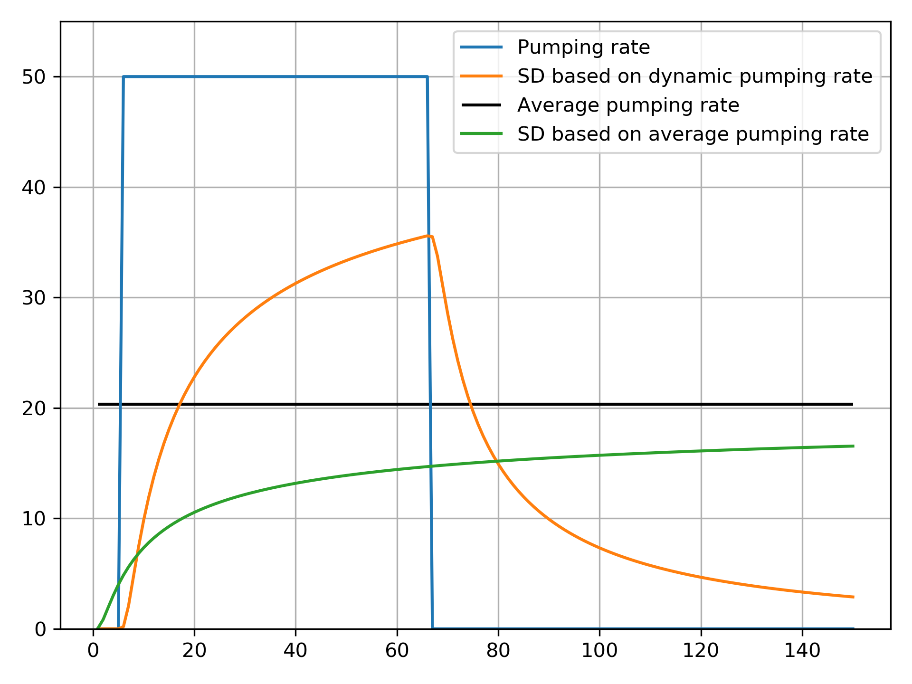

.. _usage:

======================
Using stream_depletion
======================

After installation, the python package can be executed by::

   from stream_depletion.sd_calc import *
   
This imports all the functions that you might need for your stream depletion application. The pacakge contains three functions, which are described below.

sdf
---

The ``sdf`` function calculates the Stream Depletion Factor (SDF). The input and output for this function are shown below. 

.. code-block:: python

   def sdf(L,S,T):
       '''
       Calculates Stream Depletion Factor given:
           L - Shortest distance from well to stream (m)
           S - Storage coefficient (-)
           T - Transmissivity (m2/d)
       Returns:
           y - stream depletion factor
       '''

This function can for example be called using:

.. code-block:: python

   SDF= sdf(500, 0.1, 1500)

SD
--

The ``SD`` function returns three variables:
   
   1. The stream depletion rate resulting from pumping at a dynamic rate
   
   2. The stream depletion rate resulting from pumping at a constant rate, where the constant rate is based on the average of the dynamic pumping rate
   
   3. The average pumping rate

More details are shown below:

.. code-block:: python

   def SD(L, S, T, Qpump):
    '''
    Calculates stream depletion effect given:
        L - Shortest distance from well to stream (m)
        S - Storage coefficient (-)
        T - Transmissivity (m2/d)
        Qpump - NumPy 1D array with dynamic pumping rates (L/d)
    Returns:
        sd_matrix - NumPy 1D array with stream depletion rate (L/d) based on dynamic pumping rate Qpump - unit is same as provided in the pumping rate: e.g. if pumping rate is in liters per second, then so is the stream depletion rate
        sd_avg - Numpy 1D array with stream depletion rate (L/d) based on continous pumping at the average of pumping rate Qpump
        Qavg - average of pumping Qpump (L/d)

This function can for example be called using:

.. code-block:: python

   [sd1, sd2, qavg] = SD(500, 0.1, 1500, pumpArray)

plotSD
------

With ``plotSD`` you can plot the pumping rate and the associated stream depletion rate in one graph and save it as a figure.

.. code-block:: python

   def plotSD(fname, Qpump, Qpump_sd, QpumpAvg=None, QpumpAvg_sd=None, xlabel_txt='', ylabel_txt='', title_txt=''):
    '''
    Plots the dynamic pumping and the associated stream depletion effect in one graph. If provided, then it also plots the average pumping rate with the associated
    stream depletion effect. Input:
        fname - absolute path to file name of figure to save
        Qpump - NumPy 1D array with dynamic pumping rates (L/d)
        Qpump_sd - NumPy 1D array with stream depletion rate (L/d) based on dynamic pumping rate Qpump
        QpumpAvg - Average pumping rate of Qpump (L/d) (Optional)
        QpumpAvg_sd - Numpy 1D array with stream depletion rate (L/d) based on continous pumping at the average of pumping rate Qpump (Optional)
        xlabel_txt - string to be plotted as x-axis label
        ylabel_txt - string to be plotted as y-axis label
        title_txt - string to be plotted as title
    '''

This function can for example be called using:

.. code-block:: python

   plotSD(r'c:\myFigure.png', pumpArray, sd1, qavg, sd2, xlabel='Time', ylabel='Flow [cumecs]', title='Stream depletion well A')
 
An example plot is shown below.

.. _fig_example_plot:

   
   Example figure of dynamic pumping rates (blue) and associated stream depletion rate (orange). The black line shows pumping under a constant rate (average of blue line), and the associated
   stream depletion of that (green line). 
 
 